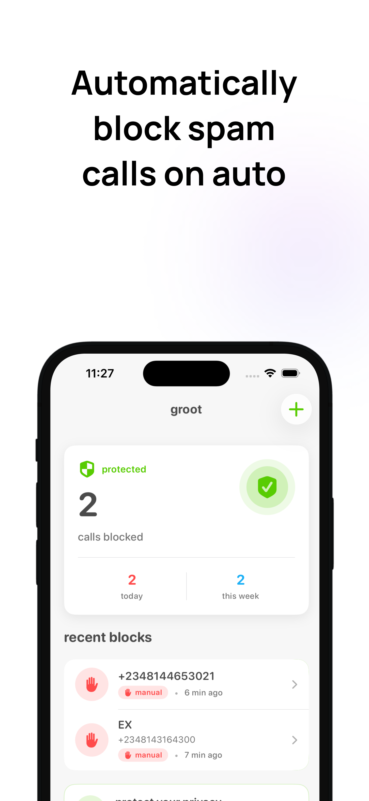
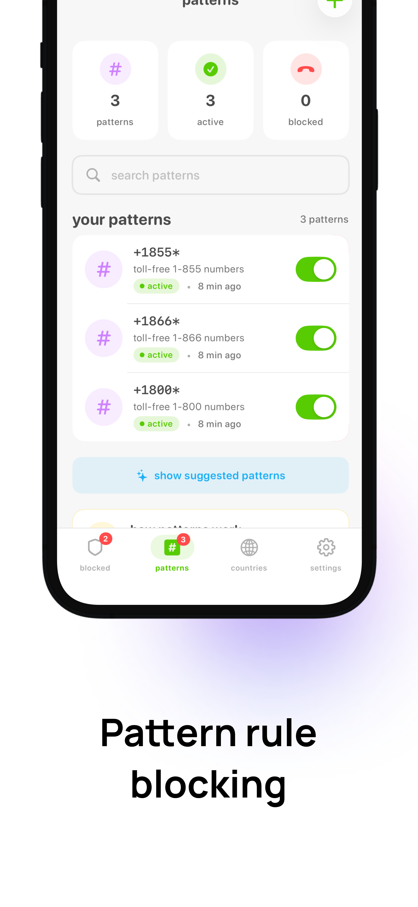
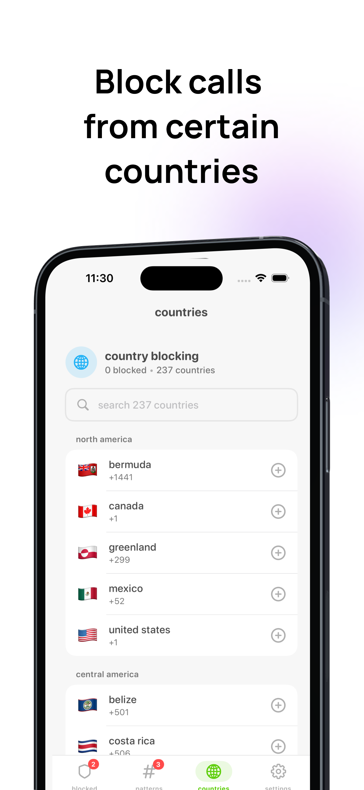
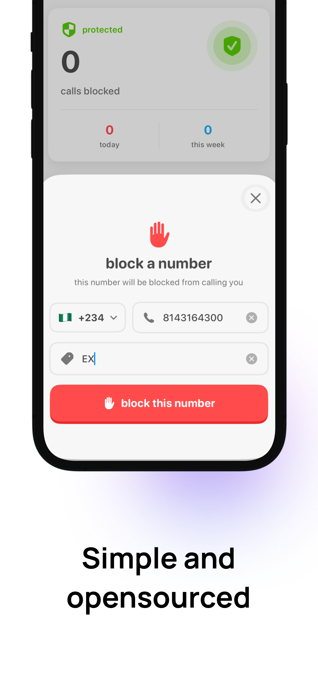
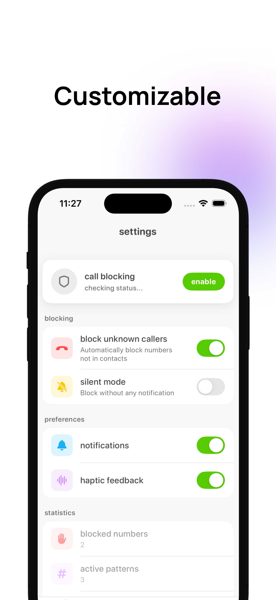

<p align="center">
  
</p>

<h1 align="center">Groot</h1>

<p align="center">
  <strong>🛡️ Your Personal Spam Call Guardian</strong>
</p>

<p align="center">
  An open-source iOS spam call blocker that puts <em>you</em> in control of who can reach you.<br>
  Built with privacy in mind — runs entirely on-device with zero data collection.
</p>

<p align="center">
  <a href="#features">Features</a> •
  <a href="#screenshots">Screenshots</a> •
  <a href="#requirements">Requirements</a> •
  <a href="#installation">Installation</a> •
  <a href="#architecture">Architecture</a> •
  <a href="#contributing">Contributing</a> •
  <a href="#license">License</a>
</p>

<p align="center">
  
  
  
  
  
</p>

---

## 🎯 Why Groot?

Tired of robocalls, telemarketers, and scam attempts interrupting your day? **Groot** silently filters them out so you only receive calls that matter.

Unlike other call blockers that harvest your data or require expensive subscriptions, Groot is:

- **100% Free** — No subscriptions, no premium tiers, no ads
- **100% Private** — All processing happens on your device
- **100% Open Source** — Audit the code yourself, contribute, or fork it

---

## ✨ Features

<table>
  <tr>
    <td width="50%">
      <h3>📵 Manual Number Blocking</h3>
      <p>Add specific phone numbers to your block list with a single tap. Perfect for persistent callers, ex-contacts, or any number you never want to hear from again.</p>
    </td>
    <td width="50%">
      <h3>🌍 Country-Based Blocking</h3>
      <p>Block calls originating from entire countries or regions. Ideal for users who receive international spam calls or don't expect legitimate calls from certain areas.</p>
    </td>
  </tr>
  <tr>
    <td width="50%">
      <h3>📋 Blocked Call Log</h3>
      <p>Review a complete history of all blocked calls. See who tried to reach you, when they called, and how many times — giving you visibility without the interruption.</p>
    </td>
    <td width="50%">
      <h3>✅ Whitelist Protection</h3>
      <p>Create an allow list of trusted contacts that will always get through, regardless of other blocking rules. Ensures important calls from family, work, or emergency contacts are never accidentally blocked.</p>
    </td>
  </tr>
  <tr>
    <td colspan="2" align="center">
      <h3>🔢 Pattern Blocking</h3>
      <p>Block numbers matching specific patterns like area codes, prefixes, or number sequences. Useful for blocking entire ranges of spam numbers that share common characteristics.</p>
    </td>
  </tr>
</table>

---

## 📱 Screenshots

<p align="center">
  
  &nbsp;&nbsp;
  
  &nbsp;&nbsp;
  
</p>

<p align="center">
  
  &nbsp;&nbsp;
  
</p>

<p align="center">
  <sub>
    <b>Left to right:</b> Dashboard with blocked call stats • Pattern-based blocking • Country blocking • Add number to block list • Customizable settings
  </sub>
</p>

---

## 📋 Requirements

| Requirement | Version |
|-------------|---------|
| iOS | 17.0+ |
| Xcode | 15.0+ |
| Swift | 5.9+ |

> **Note:** Groot uses CallKit's Call Directory Extension, which has been available since iOS 10. However, SwiftData requires iOS 17+.

---

## 🚀 Installation

### Clone the Repository

```bash
git clone https://github.com/ajagatobby/groot.git
cd groot
```

### Open in Xcode

```bash
open Groot.xcodeproj
```

### Configure App Groups

1. Select the **Groot** target in Xcode
2. Go to **Signing & Capabilities**
3. Ensure **App Groups** is configured with your group identifier
4. Repeat for the **GrootCallDirectory** extension target

### Build and Run

1. Select your target device or simulator
2. Press `Cmd + R` to build and run
3. On first launch, grant the necessary permissions when prompted

### Enable Call Blocking

After installation, you need to enable Groot in iOS Settings:

1. Open **Settings** → **Phone** → **Call Blocking & Identification**
2. Enable **Groot**
3. Return to the app and tap "Refresh" to sync your block list

---

## 🏗️ Architecture

Groot follows a clean, modular architecture using modern Swift concurrency and SwiftUI best practices.

```
Groot/
├── App/
│   ├── GrootApp.swift          # App entry point
│   └── RootView.swift          # Root navigation
│
├── Core/
│   ├── Config/
│   │   ├── AppGroupContainer.swift    # Shared data container
│   │   └── AppSettings.swift          # User preferences
│   │
│   └── Managers/
│       ├── CallBlockingService.swift  # Core blocking logic
│       ├── ContactService.swift       # Contact access
│       ├── CountryDataService.swift   # Country code database
│       └── PhoneNumberService.swift   # Number validation
│
├── Features/
│   ├── Home/                   # Dashboard & stats
│   ├── Blocked/                # Blocked numbers management
│   ├── Countries/              # Country blocking
│   ├── Patterns/               # Pattern-based blocking
│   ├── Whitelist/              # Allowed contacts
│   ├── Permissions/            # Onboarding permissions
│   ├── Settings/               # App settings
│   └── Welcome/                # First-time user experience
│
├── Models/
│   ├── BlockedNumber.swift     # Blocked number model
│   ├── BlockedCountry.swift    # Blocked country model
│   ├── BlockPattern.swift      # Blocking pattern model
│   └── WhitelistContact.swift  # Whitelisted contact model
│
├── Shared/
│   ├── Animations/             # Custom animations
│   ├── Colors/                 # Color definitions
│   ├── Components/             # Reusable UI components
│   ├── Shaders/                # Metal shaders
│   └── Typography/             # Font definitions
│
└── Resources/
    └── Assets.xcassets/        # Images & colors

GrootCallDirectory/
├── CallDirectoryHandler.swift  # CallKit extension
├── SharedModels.swift          # Shared data models
└── Info.plist                  # Extension configuration
```

### Key Technologies

| Technology | Purpose |
|------------|---------|
| **SwiftUI** | Declarative UI framework |
| **SwiftData** | Persistent data storage |
| **CallKit** | Call blocking & identification |
| **App Groups** | Data sharing between app and extension |
| **Metal** | GPU-accelerated visual effects |

### Data Flow

```
┌─────────────────────────────────────────────────────────────┐
│                        Groot App                            │
│  ┌─────────────┐    ┌─────────────┐    ┌─────────────────┐  │
│  │   SwiftUI   │───▶│  SwiftData  │───▶│  App Group      │  │
│  │    Views    │    │   Models    │    │  Container      │  │
│  └─────────────┘    └─────────────┘    └────────┬────────┘  │
└─────────────────────────────────────────────────│───────────┘
                                                  │
                                    ┌─────────────▼───────────┐
                                    │  Shared SQLite Store    │
                                    └─────────────┬───────────┘
                                                  │
┌─────────────────────────────────────────────────│───────────┐
│                  GrootCallDirectory Extension   │           │
│  ┌─────────────┐    ┌─────────────┐    ┌───────▼─────────┐  │
│  │   CallKit   │◀───│ Directory   │◀───│  Read-Only      │  │
│  │   System    │    │  Handler    │    │  SwiftData      │  │
│  └─────────────┘    └─────────────┘    └─────────────────┘  │
└─────────────────────────────────────────────────────────────┘
```

---

## 🤝 Contributing

We love contributions! Whether it's fixing bugs, adding features, improving documentation, or spreading the word — every bit helps.

### Getting Started

1. **Fork** the repository
2. **Create** a feature branch: `git checkout -b feature/amazing-feature`
3. **Commit** your changes: `git commit -m 'Add amazing feature'`
4. **Push** to the branch: `git push origin feature/amazing-feature`
5. **Open** a Pull Request

### Contribution Guidelines

- Follow Swift's [API Design Guidelines](https://swift.org/documentation/api-design-guidelines/)
- Write clean, documented code
- Add tests for new features
- Update documentation as needed
- Be respectful and constructive in discussions

### Areas We Need Help

- [ ] **Localization** — Help translate Groot to more languages
- [ ] **Testing** — Improve test coverage
- [ ] **Documentation** — Write guides and tutorials
- [ ] **Design** — Create app icons and promotional assets
- [ ] **Features** — Check our [Issues](https://github.com/ajagatobby/groot/issues) for ideas

---

## 🔒 Privacy

Groot is built with privacy as a core principle:

- **No Analytics** — We don't track you
- **No Network Requests** — The app works 100% offline
- **No Data Collection** — Your phone numbers stay on your device
- **No Third-Party SDKs** — Just pure Apple frameworks
- **Open Source** — Verify everything yourself

---

## 📄 License

Groot is released under the **MIT License**. See [LICENSE](LICENSE) for details.

```
MIT License

Copyright (c) 2026 Abdulbasit Ajaga

Permission is hereby granted, free of charge, to any person obtaining a copy
of this software and associated documentation files (the "Software"), to deal
in the Software without restriction, including without limitation the rights
to use, copy, modify, merge, publish, distribute, sublicense, and/or sell
copies of the Software, and to permit persons to whom the Software is
furnished to do so, subject to the following conditions:

The above copyright notice and this permission notice shall be included in all
copies or substantial portions of the Software.

THE SOFTWARE IS PROVIDED "AS IS", WITHOUT WARRANTY OF ANY KIND, EXPRESS OR
IMPLIED, INCLUDING BUT NOT LIMITED TO THE WARRANTIES OF MERCHANTABILITY,
FITNESS FOR A PARTICULAR PURPOSE AND NONINFRINGEMENT. IN NO EVENT SHALL THE
AUTHORS OR COPYRIGHT HOLDERS BE LIABLE FOR ANY CLAIM, DAMAGES OR OTHER
LIABILITY, WHETHER IN AN ACTION OF CONTRACT, TORT OR OTHERWISE, ARISING FROM,
OUT OF OR IN CONNECTION WITH THE SOFTWARE OR THE USE OR OTHER DEALINGS IN THE
SOFTWARE.
```

---

## 🙏 Acknowledgments

- [Apple](https://developer.apple.com) — For SwiftUI, SwiftData, and CallKit
- The open-source community — For inspiration and support
- **You** — For using and supporting Groot!

---

## 💼 Hire Me

<p align="center">
  
</p>

I'm a passionate iOS developer specializing in **SwiftUI**, **Swift**, and building beautiful, performant mobile experiences. If you're looking for someone to bring your app idea to life or need help with an existing project, I'd love to hear from you!

**Services I offer:**
- 📱 iOS App Development (SwiftUI / UIKit)
- 🎨 UI/UX Implementation
- 🔧 App Maintenance & Optimization
- 🚀 App Store Launch Support

<p align="center">
  <a href="mailto:ajagatobby@gmail.com">
    
  </a>
</p>

---

<p align="center">
  <strong>Made with ❤️ by <a href="https://github.com/ajagatobby">Abdulbasit Ajaga</a></strong>
</p>

<p align="center">
  <a href="mailto:ajagatobby@gmail.com">Email</a> •
  <a href="https://twitter.com/ajagatobby">Twitter</a> •
  <a href="https://github.com/ajagatobby">GitHub</a>
</p>

<p align="center">
  <sub>If Groot helped you, consider giving it a ⭐️</sub>
</p>
